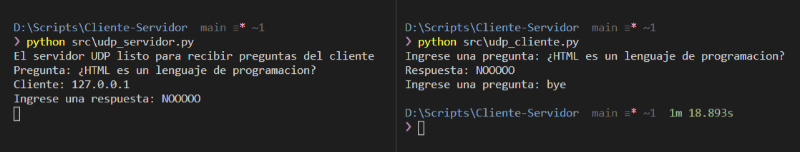

# Cliente-Servidor
Conexiones remotas cliente-servidor

## Introduccion
Establecer conexiones entre computadoras a través de las redes de datos es una de las prácticas más comunes en los sistemas. Para esto, los sistemas operativos implementan un conjunto de protocolos o reglas de comunicación que les permiten establecer las conexiones para comunicarse entre equipos remotos.

Hay dos protocolos que permiten establecer conexiones entre sistemas remotos para comunicación: TCP (Transfer Control Protocol) que es orientado a la conexión, y UDP (User Datagram Protocol) que no es orientado a la conexión, es decir, cuyas conexiones no son estrictas.

Las comunicaciones que requieren alta confiabilidad y cero pérdidas de datos se establecen con el protocolo TCP, que negocia la conexión entre los sistemas que se van a comunicar y mantiene la conexión establecida por medio de confirmaciones de datos recibidos y ordenando los paquetes de datos una vez que llegan a su destino, lo que implica precisión, pero también demoras por cada confirmación que debe enviarse y recibirse. Por otro lado, para aquellas comunicaciones donde se requiere alta velocidad a costa de la posibilidad de perder algunos paquetes en la transmisión, se utiliza el protocolo UDP.

## Cliente UDP
Toda comunicación requiere que se establezca de antemano un protocolo. El protocolo que se implementa en este chat es sencillo: una sesión de preguntas y respuestas. El cliente solicitará conectarse con el servidor y, una vez conectados, se enviarán mensajes alternando uno a la vez (es decir, uno no puede responder sino hasta que el otro haya respondido) comenzando con el cliente haciendo una pregunta. Para finalizar la comunicación, el cliente simplemente escribirá “bye” y la conexión terminará.

## Servidor UDP
Siguiendo con el protocolo de preguntas y respuestas, el servidor UDP recibe las preguntas del cliente y se envian las respuestas.

## Ejecucion
Para que el chat funcione, debes ejecutar primero el programa del servidor (udp_servidor.py).

```python	

> python src\udp_servidor.py

```
**Salida**

```
El servidor UDP listo para recibir preguntas del cliente
```

A continuación, en otra ventana de IDLE ejecuta el programa del cliente (udp_cliente.py).

```python	

> python src\udp_cliente.py

```

Escribe una pregunta en la ventana de la consola del cliente.

```	
Ingrese una pregunta: ¿HTML es un lenguaje de programacion?
```

Escribe una respuesta en la ventana de la consola del servidor.

```	
Pregunta: ¿HTML es un lenguaje de programacion?
Cliente: 127.0.0.1
Ingrese una respuesta: NOOOOO
```

Para finalizar la conexión del cliente, en la pregunta escribe la palabra “bye” (sin comillas).

```	
Respuesta: NOOOOO
Ingrese una pregunta: bye
```

## Ejemplo



